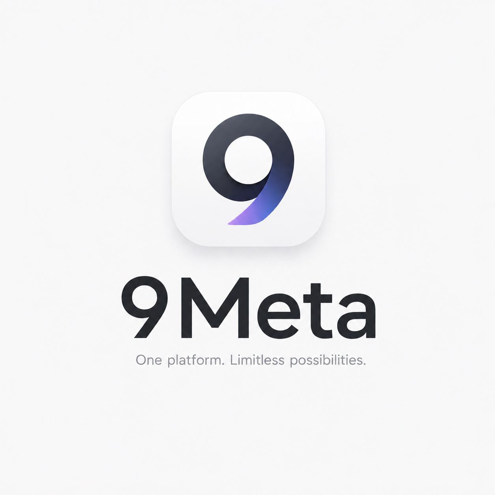

# 9Meta

<p align="center">
  
</p>

<p align="center">
  <strong>9Meta</strong> — ứng dụng desktop quản lý đa tài khoản Zalo, Messenger, Fanpage, Telegram, WhatsApp và các nền tảng chat phổ biến.
</p>

<p align="center">
  <a href="https://t.me/tiodev71">💬 Telegram</a> ·
  <a href="https://www.facebook.com/tiodev71/">📘 Facebook</a>
</p>

---

## Giới thiệu

**9Meta** là ứng dụng quản lý nhiều tài khoản chat trên desktop, được xây dựng bằng Electron/Chromium. Ứng dụng tập trung vào năng suất cho người dùng nhiều tài khoản: tách dữ liệu từng profile, quản lý CRM mini, gửi campaign Zalo, quick replies, AI rewrite, dashboard và các công cụ tiện ích khi chăm sóc khách hàng.

<p align="center">
  
</p>

---

## Tính năng chính

### 1. Quản lý đa tài khoản

- Tạo nhiều profile đăng nhập riêng biệt.
- Mỗi profile dùng session/partition riêng, hạn chế trộn dữ liệu đăng nhập.
- Hỗ trợ đặt tên, avatar, proxy và nền tảng cho từng profile.
- Chuyển nhanh giữa các tài khoản bằng sidebar bên trái.
- Badge thông báo chưa đọc theo từng profile.

### 2. Hỗ trợ nhiều nền tảng

9Meta hỗ trợ các nền tảng chat phổ biến:

- Zalo
- Messenger
- Fanpage/Facebook
- Telegram
- WhatsApp
- Teams
- Gmail

> **Lưu ý:** Một số tính năng nâng cao như gửi hàng loạt campaign hiện chỉ áp dụng cho **Zalo**.

### 3. Workspace tách dữ liệu

- Tạo nhiều workspace khác nhau.
- Mỗi workspace lưu riêng:
  - danh sách profile
  - CRM contacts
  - quick replies
  - campaigns
  - analytics events
  - AI settings
- Phù hợp khi tách dữ liệu theo dự án, khách hàng, đội nhóm hoặc nhóm tài khoản.

### 4. Dashboard / Analytics

Dashboard hiển thị nhanh:

- số lượng profile
- số CRM contacts
- số campaigns
- số quick replies
- lịch sử downloads
- activity/events gần đây
- trạng thái campaign gửi thành công/thất bại

### 5. CRM mini theo profile

- Mỗi contact CRM được gắn với profile cụ thể.
- Trường thông tin hỗ trợ:
  - tên khách hàng
  - số điện thoại
  - trạng thái
  - tags
  - ghi chú nội bộ
- Có thể lấy nhanh snapshot từ tab chat hiện tại để điền CRM.
- Dùng CRM làm nguồn target cho campaign Zalo.

### 6. Campaign Zalo / gửi tin nhắn hàng loạt

Tính năng campaign hiện được giới hạn cho **Zalo**.

Hỗ trợ các chế độ:

- **Gửi qua tất cả tài khoản Zalo**
  - Lần lượt chuyển qua từng profile Zalo trong workspace.
  - Gửi nội dung vào hội thoại Zalo đang mở sẵn của từng tài khoản.
  - Có delay ngẫu nhiên giữa các lần gửi.
  - Có log theo từng tài khoản.

- **Gửi ở Zalo account hiện tại**
  - Gửi tin nhắn bằng profile Zalo đang active.
  - Phù hợp khi bạn chỉ dùng một tài khoản Zalo cho campaign.

- **Assist mode an toàn**
  - Không tự động thao tác gửi mạnh.
  - Lưu queue/log để bạn tự kiểm soát quá trình gửi.

Campaign hỗ trợ:

- tên chiến dịch
- nội dung tin nhắn
- delay min/max
- giới hạn target/contact
- pause campaign
- stop campaign
- log sent/failed

> **Quan trọng:** Mode gửi qua tất cả tài khoản Zalo hiện gửi vào **hội thoại đang mở sẵn** của từng tài khoản. Nếu muốn tự tìm contact, tự mở đúng hội thoại theo số điện thoại/tên rồi gửi, cần phát triển thêm phase tự động tìm kiếm/open chat.

### 7. Quick Replies

- Lưu các mẫu tin nhắn thường dùng.
- Gõ shortcut dạng `/1`, `/2`, `/3`... trong ô chat rồi Enter để chèn/gửi nhanh mẫu tin.
- Có popup gợi ý khi gõ `/`.
- Quick replies được lưu theo workspace.

### 8. AI Quick Reply / Rewrite

- Cấu hình AI endpoint, API key và model.
- Viết lại nội dung tin nhắn theo nhiều mục tiêu.
- Copy nhanh kết quả AI.
- Lưu kết quả AI thành quick reply.

Ví dụ dùng AI để:

- viết lại tin nhắn bán hàng tự nhiên hơn
- làm nội dung ngắn gọn hơn
- làm nội dung lịch sự hơn
- tạo phản hồi chăm sóc khách hàng

### 9. Chống seen / typing

- Có tùy chọn chặn seen.
- Có tùy chọn chặn typing.
- Hỗ trợ nhiều nền tảng tùy theo API/DOM thực tế.

### 10. Tự xử lý popup Zalo

9Meta tự động xử lý một số popup/banner hay xuất hiện trên Zalo Web:

- tự ấn **Cho phép** khi Zalo hỏi quyền truy cập thư mục tải về
- tự đóng banner **Sử dụng Zalo PC... Tải ngay**
- chỉ áp dụng logic này cho Zalo

### 11. Downloads manager

- Theo dõi file đang tải.
- Hiển thị trạng thái tải.
- Mở file sau khi tải xong.
- Mở thư mục chứa file.
- Xóa item khỏi danh sách downloads.

### 12. Lock app / bảo mật

- Khóa ứng dụng bằng mật khẩu.
- Hỗ trợ lock khi khởi động.
- Phím tắt nhanh khóa app: `Ctrl/Cmd + L`.

### 13. Tiện ích cửa sổ

- Dark mode / light mode.
- Zoom in / zoom out.
- Fullscreen.
- Always on top.
- Reload tab.
- System tray.
- Auto updater.

---

## Cách sử dụng

### 1. Chạy ứng dụng ở môi trường dev

Cài dependencies:

```bash
npm install
```

Chạy app:

```bash
npm start
```

### 2. Build ứng dụng

Build Windows:

```bash
npm run build
```

Build macOS:

```bash
npm run build:mac
```

Build bản portable Windows:

```bash
npm run build:portable
```

---

## Hướng dẫn dùng nhanh

### Thêm tài khoản mới

1. Bấm nút **+** ở sidebar.
2. Nhập tên tài khoản.
3. Chọn nền tảng, ví dụ `Zalo`.
4. Có thể thêm proxy/avatar nếu cần.
5. Bấm **Lưu**.
6. Đăng nhập tài khoản trong tab vừa tạo.

### Chuyển tài khoản

- Bấm vào avatar/profile ở sidebar bên trái.
- App sẽ chuyển sang BrowserView/session của profile đó.

### Sửa hoặc xóa tài khoản

- Click chuột phải vào profile trong sidebar.
- Sửa tên, nền tảng, proxy hoặc avatar.
- Có thể xóa profile nếu workspace còn nhiều hơn 1 profile.

### Tạo workspace

1. Bấm nút **Workspace**.
2. Nhập tên workspace mới.
3. Bấm tạo workspace.
4. App sẽ chuyển sang workspace mới với dữ liệu riêng.

### Dùng CRM mini

1. Chọn profile cần quản lý khách hàng.
2. Bấm **CRM**.
3. Nhập thông tin contact:
   - tên
   - số điện thoại
   - trạng thái
   - tags
   - ghi chú
4. Bấm **Lưu contact**.

Nếu đang mở sẵn một hội thoại, có thể dùng nút lấy snapshot tab hiện tại để điền nhanh thông tin.

### Tạo campaign Zalo

1. Chọn một profile nền tảng **Zalo**.
2. Bấm **Campaign**.
3. Nhập tên chiến dịch.
4. Nhập nội dung tin nhắn.
5. Chọn delay min/max.
6. Chọn giới hạn target.
7. Chọn mode gửi:
   - `Gửi qua tất cả tài khoản Zalo`
   - `Gửi ở Zalo account hiện tại`
   - `Assist mode an toàn`
8. Bấm **Tạo campaign Zalo**.
9. Chọn campaign vừa tạo.
10. Bấm **Chạy campaign chọn**.

> Khuyến nghị: nên test với 1-2 tài khoản trước, dùng delay cao như 5-15 giây để giảm rủi ro bị nền tảng hạn chế thao tác tự động.

### Dùng Quick Replies

1. Bấm **Quick Replies**.
2. Thêm mẫu tin nhắn.
3. Trong ô chat, gõ `/1`, `/2`, `/3`... tương ứng với thứ tự mẫu.
4. Nhấn Enter để dùng mẫu.

### Dùng AI Rewrite

1. Bấm **AI**.
2. Nhập AI endpoint.
3. Nhập API key.
4. Nhập model, ví dụ `gpt-4o-mini`.
5. Nhập nội dung cần viết lại.
6. Chọn mode rewrite.
7. Bấm chạy AI.
8. Copy kết quả hoặc lưu thành quick reply.

### Khóa app

- Bấm nút khóa trên giao diện, hoặc dùng phím tắt:

```text
Ctrl/Cmd + L
```

Lần đầu khóa app, bạn sẽ được yêu cầu tạo mật khẩu.

---

## Dữ liệu được lưu ở đâu?

Dữ liệu workspace được lưu trong thư mục `userData` của Electron, theo cấu trúc tương tự:

```text
userData/
  workspaces/
    index.json
    <workspace-id>/
      data.json
```

Mỗi workspace có file `data.json` riêng để tách dữ liệu.

---

## Lưu ý an toàn khi dùng campaign

- Không nên gửi quá nhanh.
- Không nên gửi nội dung spam hoặc vi phạm chính sách nền tảng.
- Nên dùng delay ngẫu nhiên đủ lớn.
- Nên test bằng tài khoản phụ trước.
- Với Zalo, nên mở sẵn hội thoại cần gửi nếu dùng mode auto hiện tại.

---

## Tech stack

- Electron
- Chromium BrowserView
- HTML
- CSS
- JavaScript
- electron-builder
- electron-updater

---

## Scripts

| Lệnh | Chức năng |
| --- | --- |
| `npm start` | Chạy app ở chế độ dev |
| `npm run build` | Build Windows installer |
| `npm run build:mac` | Build macOS DMG/ZIP |
| `npm run build:portable` | Build Windows portable |

---

## Tác giả

**Nguyễn Đình Thọ / Tiodev71**

- Telegram: <https://t.me/tiodev71>
- Facebook: <https://www.facebook.com/tiodev71/>

---

## License

MIT
